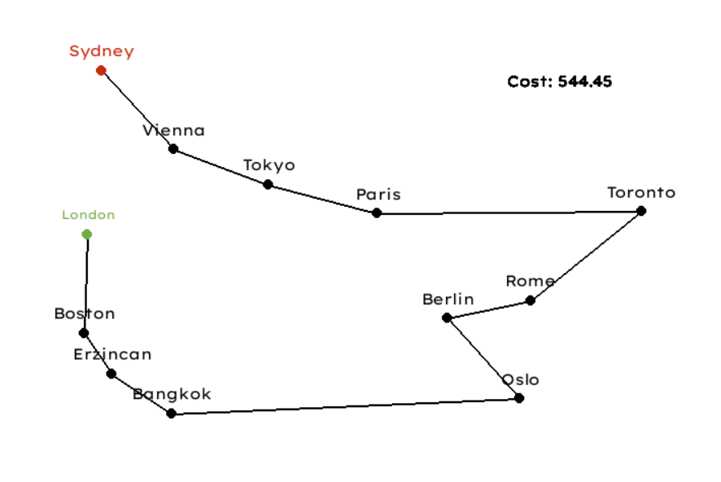

# Artificial Intelligence Homework 2

## Description

This repository contains detailed content for a homework assignment. It comprises solutions to three challenges: an implementation of Genetic Algorithm, a Q-Learning implementation along with its analysis under various environmental conditions, and a Deep-Q learning implementation for the game Flappy Bird. For a deeper understanding, please refer to the included homework PDF file. Additionally, I highly recommend reviewing the report PDF file located in the "docs" directory, where each part is extensively explained.

## Example Images

